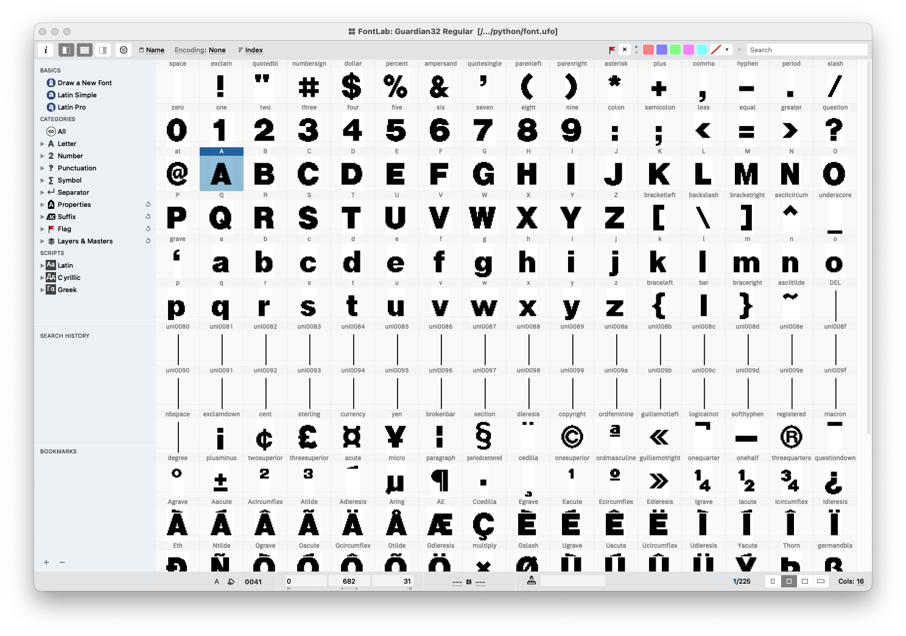

# Amiga Bitmap Font Tools

## Introduction

A set of tools to read and parse bitmap font files as used by the Commodore Amiga.

## What are bitmap fonts?

Chances are you’re reading these words on a device with nice, crisp text. The typeface you’re looking at now is drawn from mathematical lines and curves, which means it can be scaled up and down to look good at large and small sizes. It wasn’t always this way.

Early home computers such as the ZX Spectrum rendered text as a series of dots, or pixels, typically arranged in a monospaced 8×8 grid. Then came next generation home computers such as the Commodore Amiga. Text on the Amiga took a step forward in that fonts were no longer limited to the 8×8 box. Glyphs could be larger and have proportional widths – it was possible to create bitmap fonts bearing a passing resemblance to proper typefaces found in print!

On the Amiga, a bitmap font, as stored on disk, consists of:

- a `.font` file (The 'font contents' file)
- a similarly named directory, containing a series of files bearing numeric names ('font descriptor' files) 

So for the font Sapphire, there is a file called `sapphire.font`, and a directory called `sapphire` containing the files `14` and `19`, corresponding to fonts with pixel heights of 14
and 19 respectively.

You can find more details of what's going on here at https://andrewgraham.dev/category/bitmap-fonts/.

## Quick start

If you just want to convert some Amiga files into ttf or otf fonts for use in your applications, then you'll need the Python scripts.
Head on over to the `/python` folder and follow the instructions there.

## What's in all the directories?

Here you'll find:

- in `/python`, some Python scripts to convert Amiga native files into other formats (ttf, otf, ufo).
- in `/glyphsapp`, some scripts and plugins to import Amiga native files and JSON files into the [Glyphs](https://glyphsapp.com) font editor.
- in `/node`, some Node.js scripts to parse font contents and font descriptor files, and output the data in JSON format.

Have a look in each folder for (slightly) more detailed READMEs.

## Sample fonts

Webcleaner, a set of fonts originally designed for Amiga web browsers, are available in the `fonts\webcleaner` directory for your experimentation.

Some other fonts of my own making are available in `fonts\native`. Some of the glyphs are a bit shabby but in fairness they're thirty
years old and I didn't have much access to the internet back then to know what they looked like.

Have fun!
